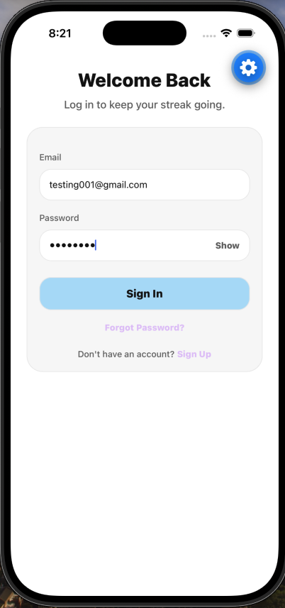
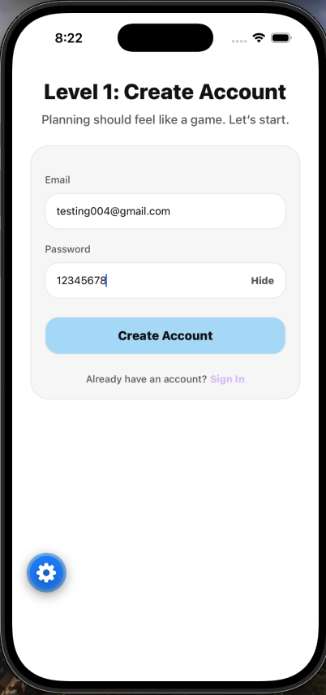
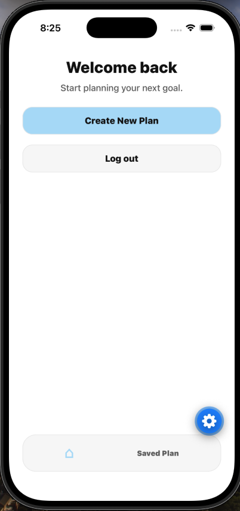
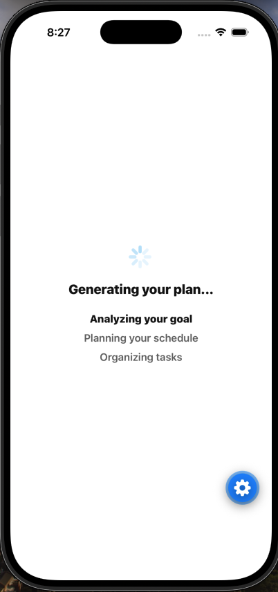
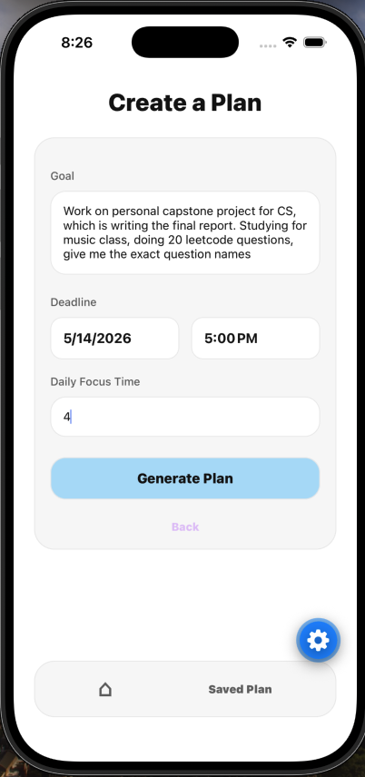
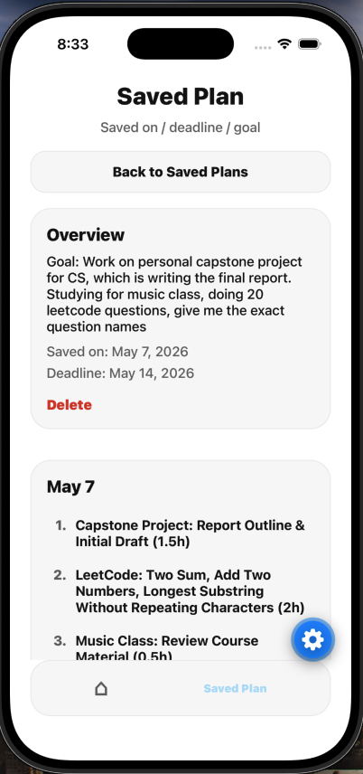
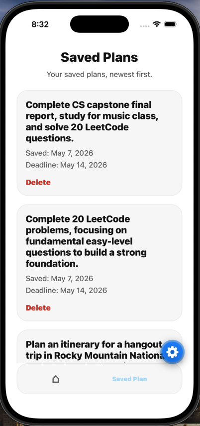
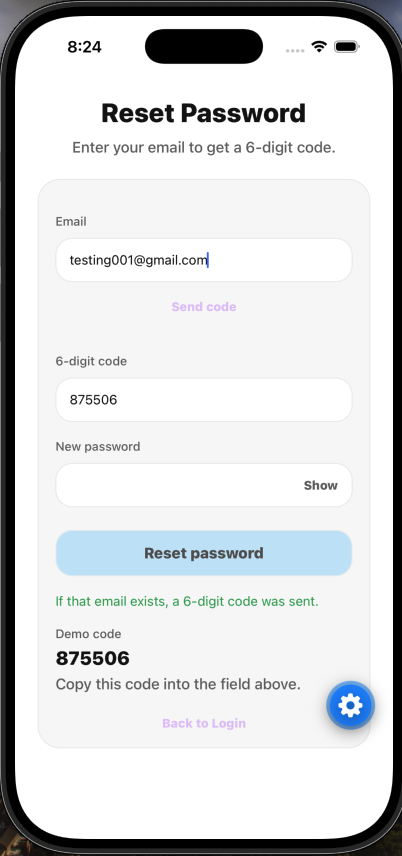

# Type-A Buddy

Type-A Buddy is a planning assistant with a FastAPI backend and an Expo mobile app. The backend is deployed on Render and uses MongoDB Atlas.

## Architecture
- Backend: FastAPI + MongoDB (Motor)
- Mobile: Expo (React Native)
- AI: Gemini (via `google-genai`)

## Quick Start (Professor Setup)
The backend and MongoDB are already deployed. You only need to run the mobile app locally.

1) Install prerequisites
- macOS with Xcode (iOS Simulator)
- Node 18+

2) Mobile setup
- See [mobile/README.md](mobile/README.md) for the exact steps.

## Production Notes
- Backend is deployed on Render and uses MongoDB Atlas.
- Password reset email is disabled on Render Free (SMTP ports blocked). A demo mode returns the reset code in the API response when enabled.

## Limitations / Trade-offs
- Render Free cannot send outbound SMTP on ports 25/465/587, so transactional email is not available without a paid plan or an email API over HTTPS.
- Render Free instances can spin down when idle, causing cold starts.

## Demo Password Reset (Free Tier)
Render Free blocks outbound SMTP (ports 25/465/587), so transactional emails cannot be delivered. To keep the flow demoable without paid services, the backend exposes the reset code in the API response when `PASSWORD_RESET_RETURN_CODE=true`.

Demo flow:
1) User taps "Forgot password" and submits their email.
2) Backend generates and stores a reset code in MongoDB.
3) The API returns the code; the app shows it in the UI.
4) User copies the code into the reset form and sets a new password.

## Media (Photos / Video)

### Screenshots
Screens show the end-to-end user journey from authentication to creating and managing plans.

### Demo Videos
<video src="docs/gen-plan-screen.mp4" controls width="640"></video>

<video src="docs/delete-saved-plan-flow.mp4" controls width="640"></video>

---

See [mobile/README.md](mobile/README.md) for detailed setup steps. See [backend/README.md](backend/README.md) for backend details.
